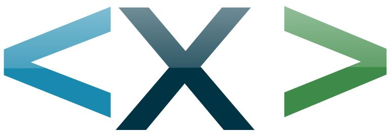

# Total.HTM Easy

NoCMS. HTML.

Your web rocks! 

Total.HTM Easy is a website making strategy with focus on **web standards**. You know, that is that thing that all browsers are supporting the current century, or at least the next decades. Namely: 

* HTML 5
* CSS 3
* JavaScript (Vanilla, EcmaScript)
* JSON, SVG, font, media, ...

Total.HTM Easy is Open Source using the JSON-license, that is based on the MIT-license. **You can** use Total.HTM Easy even for commercial purposes.    

The demo-website is the project-website, created with Total.HTM Easy itself: https://exa.run/Total.HTM-Easy/

All websites of http://exa.run are made with Total.HTM Easy.


## Why this software project?

Collectively cultivating languages is all that culture is about. 

HTML, CSS and JS are great famous languages, they give us all the power we need and want.

Total.HTM Easy is just a best practice way of using our beloved web languages. No framework. No updates. 

Total.HTM Easy comes with a MAKE-script that generates optimized output at a click. You care for content and creativity, the hard work is done for you by the MAKE-script at your hands.

HTML totally easy!


## For whom is it?

* Developers, Hackers, Coders 
* Web Designers and Content Creators
* Non-Profits, Communities, Artists, ...
* Businesses, Decision Makers, ...
* Any authentic Internet-hero


## What makes Total.HTM Easy so great? 

* Recommended **web standard** use
* Save time and headache, optimizing done by **MAKE-script**
* **Fit for business**, very fast and stable static output
* Search Engine Optimized, **SEO**, all good websites need
* No need to update, web standards get **never out of date**
* Barrier-free **UX** (user experience).
* **Mobile ready** at highest speeds at all display sizes    
* Everybody can **start learning** being a maker in the real web   
* Lots of nice, **useful stuff** included, such as slideshow

Please realize one technical fact: There is nothing better than HTML, CSS & JS in the web. 
This is what any other system would produce as output anyway. 

**Who told you, you could not master real web technology yourself?**

Check out Total.HTM Easy! The web hero tool.

More good reasons to use Total.HTM Easy: https://exa.run/Total.HTM-Easy/#developer


## What it is

* Total.HTM Easy is a website, and a **website-template**
* Total.HTM Easy is a **SPA** (Single Page Application)
* Total.HTM Easy is a **PWA** (Progressive Web Application)
* Total.HTM Easy is 100% open and **free**
* Total.HTM Easy is 100% web **standards**
* Total.HTM Easy is framework-free
* Total.HTM Easy is **responsive**, mobile-first
* Total.HTM Easy is a **Static** Site Generator (SSG)
* Total.HTM Easy is a set of **HTML5** best practice
* Total.HTM Easy is strategy, paradigm, **architecture**
* Total.HTM Easy is just **one good way** to make websites
* Total.HTM Easy is a statement towards an **Ethical Internet**


## What it is NOT

* Total.HTM Easy is not a JS framework, but has lots of nice EcmaScript for your use 
* Total.HTM Easy is not a framework at all, it is code-as-example for reuse 
* Total.HTM Easy is not a headless CMS (those focus on the server-side) 
* Total.HTM Easy is not a CMS at all (no pre-defined editor-workflow or content-versioning) 
* Total.HTM Easy is not conforming to the enforced nihilism propagated by OSD or FOSS
* Total.HTM Easy is not part of strange ecosystems such as NPM, or App-Stores 
* Total.HTM Easy is not adding to Clouds-of-Others, Data-Silos, Privacy-Dealing, etc. 
* Total.HTM Easy is not complicated ;)

Don't waste your time with big players and confusing pseudo-freedoms. Play your own game! Work with the real Internet, just the way it was intended from the beginnings on. Be a free actor in the World Wide Web. **Start now!** 

Note: The fact that Total.HTM Easy is not a framework or CMS, does not mean you could not connect any framework you liked. Really, with web standards you can do anything. Show us your cool combies, such as with Vue, or with a Headless CMS at the backend.  


## Getting Started

You have a few options:

* Minimal Use
* Regular Use on Your Local Computer
* Regular Use on Your Own Server
* Hosted Use On Our Servers (with Extra-Support options) 


### Prerequisites

**You need to be savvy navigating and editing HTML & CSS files, ...**

**... or at least willing to learn such a cool thing.**


### Minimal Use

The minimal use works without anything set up. No web-server needed. 

Minimal use is possible with any web-browser and any text-editor. 
In this scenario you don't even use the MAKE-script to create
optimized output. You just edit the file /_HTM/Total.HTM and you
call this file directly into your browser.

Note: Not recommended for production websites with many users! 
This is just a very-easy possibility for very simple web projects. 

Of course you can add and edit your own CSS and JS in the files /js/X.js
and /css/X.css or in other ways you like. 

Note: For minimal use you dont need the folders /_login/ and /_make/

Tip: This minimal use can be a great strategy for **prototyping**.  

Note: In fact, the **'Minimal Use' is the killer-feature of Total.HTM Easy**, 
and this is why the project has its name. You can open the file just in any 
local web browser, without setting up anything. 

Note: Opening a locally stored HTML-website on file-basis in a modern web-browser
can not harm your computer by definition. Browsers run local HTML-sites in a 
safe 'sandbox'. Thus, the minimal use is risk-free. 

Note: HTML and HTM are the same. Both are valid technical terms and valid file-extensions. We do prefer 'HTM' in filenames and code, and we prefer 'HTML' in natural language writing. Don't mind, just know: HTM and HTML is same same. 


### Regular Use on Your Local Computer

**You need to be able to run a local web-server.**

To run the MAKE-script, you need:

* PHP (>=5) running on a web-server such as Apache (LAMPP-stack)
* File-Access for PHP-scripts (read and write)

Setting up your own web-server on your local computer with PHP may require 
some significant technical skills. Among others, you have these options: 

* Install [XAMPP for Windows](https://www.apachefriends.org/) at your computer and start Apache. 
* Just upload to your hosting provider. They usually have PHP out of the box.
* Let us help you with all that. Professionally. [Contact Us](https://exa.run/Total.HTM-Easy/#contact)


### Regular Use on Your Own Server

**You need to be able to upload files to a server of your choice.**
**It's maybe helpful to have your own safe local web-server as well.**

Your web-server needs to support:

* PHP (>=5) 
* File-Access for PHP-scripts (read and write)

You need a way to upload all the project files, usually done using FTP, FTPS. 

Note: You can upload the whole Total.HTM-system including /_login/ and /_make/ to your web-server. This way you can use MAKE online. But, many people might want to run the Total.HTM-system locally, and only upload the 'Release'-output to the online-server. 

If you only upload the Release-output to your web-server, that server does not even need PHP or anything. The release consists of optimized static web output only. Easy to cache, easy to distribute in any way desired. CDN, Cloud, etc. 
  

### Installing

Copy the whole project (as download-able here) to your desired location.

```
Example-location: http://my-server/my-folder/
```

Test, if all went well, by opening the following address in your browser:

```
http://my-server/my-folder/_Total/_HTM/

```

If something else than a 404-Error appears, the files are at their place,
and PHP is running. 


### Configuration 

Total.HTM Easy comes with the configuration-management-tool called 
'[Confi Config PHP](https://github.com/ernesto-sun/ConfiConfigPHP)'. 
Of course Open Source and easy to use ;)

To create or change your configuration, open 'config_script.php' and edit 
your secret API-Key at the very top of the file.

A call to the 'config_script.php' can look like this:

```
http://my-server/my-folder/_Total/config_script.php?ak=hd873d8h28h2

```
   
Use the files that match ``` 'config_set_*.php' ``` to set your values. Don't 
forget to call the 'config_script.php' to effectively write the changes.  	 


### Setting Up the Login 

With Total.HTM Easy comes a login-system, that can be used to be able to 
perform the MAKE-script directly online from any device. After login, a
button called 'MAKE' appears at the main menu. 

Total.HTM can also permit user-login to Web-Apps. But here, we only speak about
an Admin-Login to the Total.HTM-Easy-System. Thus, you only need to create one
Admin-User that is allowed to click 'MAKE'.

To create your personal admin-user, just enter your desired password into the 
file ``` /_Total/config_set_sec.php ``` under value ``` '__ADMIN__' => 'xxx' ```

Please do not use 'xxx' as value but a strong, unique, random password that
you only use at this website and that you store at a safe place. If you have 
troubles managing your many passwords, please check out the very helpful 
class of software tools that are called 'Password Managers'. I love Keepass.


### Performing a MAKE

In some cases you want to perform MAKE after a login from your Total.HTM.
If so, set up the admin-user (as explained in the previous chapter), and
try to login. 

After a successful login the system shall show a green wheel next to the 
hamburger menu symbol at the right top. Inside that menu shall be a 
little button just saying 'MAKE'.

When you click 'MAKE' a process starts that can take up to a minute or even
more, depening on the amount of work the script has with images, languages,
HTML-transformation, copying, deleting old version, etc.

At a slow notebook at 2021 the website of http://exa.run/Total.HTM-Easy 
takes me about 20 seconds to perform a full-features MAKE. Quite some
time at modern times. Optimizing MAKE performance is a all-time-TODO.

Note: At the file /_Total/config_set_make.php you have a number of 
options to configure the MAKE process. Dont forget to run the config-
script after editing settings always. 

Note: You can also call MAKE directly from your browser by using an
API-key that is set in config_set_make.php. Only do that if you know what
you do (as usual of course). On default MAKE by API-key is disabled.


### Documentation

There is a old 'book' from ages long gone. Work, work, work. I need to
create a good new docu ... No, wait ... WE need to create a great docu
all together! 

Please help! Honestly, publishing such a small little Open Souce project 
like this one means quite some work. Among the many things I learned, 
is, to understand how digital activists can get into stress, while all 
people around them think the person is doing nothing.

BUT: And this BUT is big intentionally. BUT, there is the source code!
And all the nice comments. The simple, flat, self-speaking, English-kept
source code. Maybe it is worth reading. 

I do think, when it comes to software, the source code shall be the first 
and best reference. 


## Built With

* HTML 5, CSS 3, Vanilla JS (and more standards such as SVG, JSON, etc.)
* [PHP](https://www.php.net/credits.php) - Love the work of the PHP team! 


## Included Code of Others, Acknowledgments 

All code used by others is licensed under MIT, BSD, JSON and alike.
I am welcoming a discussion how far dependencies can and shall be 
reduced. 

* [php-image-resize](https://github.com/gumlet/php-image-resize) 
* [jsmin-php](https://github.com/rgrove/jsmin-php) (c) 2002 Douglas Crockford  (www.crockford.com)
* [phpQuery](https://code.google.com/archive/p/phpquery/)

Note: These external dependencies come _only_ with the MAKE-script. The website itself, and the release output have **no dependency at all**.


## TODO and Ideas

At many places of the code you can find comments that look like ``` // TODO: Improve this and that ```

A list of some 'high-level'-TODO's:

* Allow FTPS directly after MAKE as automatic step
* Refined cracker defense strategies 
* Enhance and test PWA (Progressive Web App) using '_sw.js' generated by MAKE
* Optimizing MAKE performance. (Using diff-methods)
* Connect to some headless CMS and/or to the GIT ecosystem for content-versioning


## Testing and Bug-Reports

Tested Browsers: Chrome, Firefox, Edge, Safari  (All features with JavaScript)

Note: The auto-generated No-JavaScript-website 's.htm' works on anything that carries 'web' in its name.

Please always keep in mind if you are testing the file 'Total.HTM' or the 'Release'. These are two different websites in fact. Both need to look the same in the browser, but only the 'Release' runs optimized and error-free. Some warnings running 'Total.HTM' itself are even wanted.

When you report a bug, please include as much relevant information as possible. Such as your browser, your operating system etc. But don't worry if this is too much for you. Just contact us. We are happy for any kind of bug-reports. 

Yes, we want you happy! Why? Because we do not only share an Internet together, but a whole planet! 


## Contributing

Please read [CONTRIBUTING.md](CONTRIBUTING.md) and become part of this project. 
You are welcome! Even with harsh critics or some very strange idea.  

The people define the project. Be one of us!


## Versioning

We use version numbers like V02, V03 for public releases. Internally we use
timestamps to identify versions. Such as '20201221' for 21. Dec, 2020. 

TODO: A better versioning-strategy that fits into the GitHub-ecosystem.


## Authors

* **[Ernesto Sun](http://ernesto-sun.com)** 
* **You are welcome!**


## License

This project is licensed under the **JSON License** - see the [LICENSE.md](LICENSE.md) file for details.


